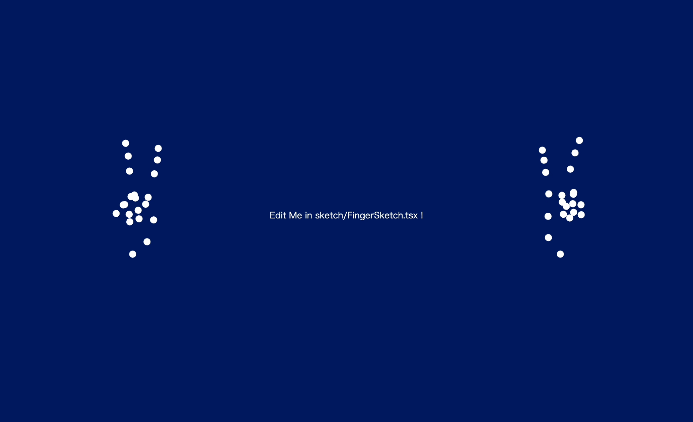

## Overview

p5.js で tensorflow が提供する[hand-pose-detection](https://blog.tensorflow.org/2021/11/3D-handpose.html)モデルを使用できるよう作成したフレームワーク.プロジェクトファイル内に存在する sketch ファイルを編集することで容易に手指の動きを用いたインタラクティブなクリエイティブコーディングが可能なほか, 生のデータを平滑化した滑らかな手指の動きなどを使用できる関数群を提供する.



本アプリケーションは [CC-BY 4.0](https://creativecommons.org/licenses/by/4.0/) のもとで公開しています。適切なクレジット表記のもと、商用利用含めご自由に利用ください。ご連絡は不要です。

## Getting Started

本フレームワークの動作には node.js が必要です。Next.js のインストール手順は <br/>
Mac: [Mac に Node.js をインストール](https://qiita.com/kyosuke5_20/items/c5f68fc9d89b84c0df09)　<br/>
Windows: [Node.js をインストールする](https://qiita.com/sefoo0104/items/0653c935ea4a4db9dc2b)

1. github のリポジトリから最新版のプロジェクトをダウンロードする.安定版は releases 一覧から最新のものを選択, 最新のものは「Code > Download ZIP」を選択. ダウンロード後, zip ファイルを展開する.
2. ターミナル（コマンドプロンプト）でダウンロードしてきたディレクトリに移動し,以下を実行.

```bash
npm install
# or
yarn install
```

### 実行について

同じくダウンロードしてきたディレクトリ内で, 以下を実行. [http://localhost:3000](http://localhost:3000)にて実行結果を確認.

```bash
npm run dev
# or
yarn dev
```

カンバス内を編集していく場合は, `sketch/HandSketch.tsx`を編集する.<br/>
[p5.js](https://p5js.org/)で記述できるが, p5 の関数や p5 特有の変数（カンバスサイズを有する width, height 変数や, textAlign を指定する際の CENTER といったオプションなど）を使用する際は, その先頭に`p5`をつける必要があることに注意.

## 関数について

描画に関連する関数は次のとおり：

### getShapedRawHandpose

```typescript
const getShapedRawHandpose: (rawHands: handPoseDetection.Hand[]) => {
  left: handPoseDetection.Keypoint[];
  right: handPoseDetection.Keypoint[];
};
```

(rawHands: handPoseDetection.Hand[]) => {left: handPoseDetection.Hand[], right: handPoseDetection.Hand[]}

- tensorflow によって取得された手指の動きを, 左手, 右手といった形で呼び出せるよう整形された形式で取得できる関数. 引数に tensorflow から取得してきた手指の姿勢情報をそのまま入力する.

### getSmoothedHandpose

```typescript
const getSmoothedHandpose: (
  rawHands: handPoseDetection.Hand[],
  keyframes: {
    left: handPoseDetection.Keypoint[][];
    right: handPoseDetection.Keypoint[][];
  }
) => {
  left: handPoseDetection.Keypoint[];
  right: handPoseDetection.Keypoint[];
};
```

- 手指の動きを, 前後 5 フレーム分の情報を用いて平滑化したものを取得できる関数.tensorflow から取得してきた手指の姿勢情報に加え, これまでの姿勢情報を持つ `handposeHistory` を渡す必要がある.また, `handposeHistory` を使用するためには`updateHandposeHistory()`関数を用いて毎フレーム`handposeHistory`を更新する必要がある.
